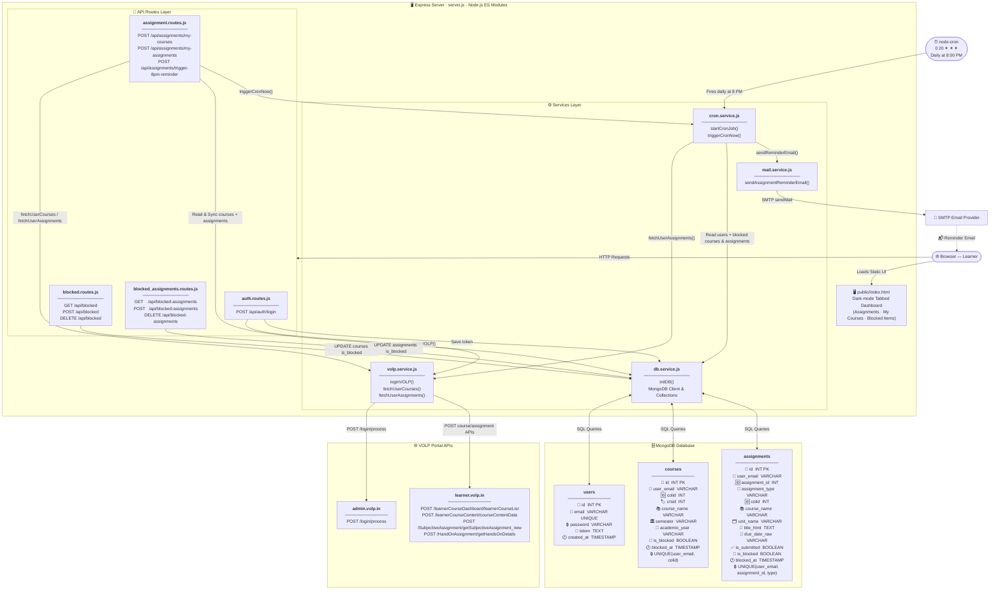

# VOLP Assignment Reminder — Prototype Web Application

A modern **Express + Node.js (ES Modules)** application that:
1. Authenticates users against the live **VOLP portal** (`https://admin.volp.in/login/process`).
2. Persists user credentials and session tokens in a **MongoDB database**.
3. Lets users **block specific courses** so those courses are skipped during all assignment fetches and email reminders.
4. Runs a **configurable cron job** (default: daily at 8:00 PM `0 20 * * *`) that fetches assignments and sends summary emails through an SMTP provider.
5. Serves a **tabbed web dashboard** to log in, view assignments, manage blocked courses, and manually trigger reminder emails.

---

## 🏗️ System Architecture



---

## 🗺️ Sequence Flow Diagrams

---

### UC-1 · User Login & Registration

```text
  User (Browser)            auth.routes.js        volp.service.js        MongoDB (users)
       │                          │                      │                     │
       │  Enter email + password  │                      │                     │
       │  POST /api/auth/login    │                      │                     │
       │─────────────────────────▶│                      │                     │
       │                          │  loginVOLP(u, pwd)   │                     │
       │                          │─────────────────────▶│                     │
       │                          │                      │  POST admin.volp.in │
       │                          │                      │  /login/process     │
       │                          │                      │──────────────────── ▶ VOLP API
       │                          │                      │◀─────────────────── ─ { token }
       │                          │◀─────────────────────│                     │
       │                          │   return token       │                     │
       │                          │                      │                     │
       │                          │  INSERT INTO users   │                     │
       │                          │  (email, pwd, token) │                     │
       │                          │────────────────────────────────────────────▶
       │                          │◀───────────────────────────────────────────
       │                          │  { success, email, token }                 │
       │◀─────────────────────────│                      │                     │
       │  Show Dashboard          │                      │                     │
```

---

### UC-2 · Login Failure (Invalid Credentials)

```text
  User (Browser)            auth.routes.js         volp.service.js
       │                         │                       │
       │  POST /api/auth/login   │                       │
       │  { bad credentials }    │                       │
       │────────────────────────▶│                       │
       │                         │  loginVOLP(u, pwd)    │
       │                         │──────────────────────▶│
       │                         │                       │  POST admin.volp.in
       │                         │                       │──────────────────── ▶ VOLP API
       │                         │                       │◀─────────────────── ─ 401 / no token
       │                         │                       │
       │                         │                       │  throw Error("VOLP login failed")
       │                         │◀──────────────────────│
       │                         │
       │  HTTP 401               │
       │  { error: "Authentication failed: ..." }
       │◀────────────────────────│
       │  Show error message     │
```

---

### UC-3 · Automated Daily 8:00 PM Email Reminder Run

```text
  node-cron (timer)       cron.service.js        MongoDB               volp.service.js       mail.service.js
        │                       │                  │                         │                     │
  fires daily at 8 PM           │                  │                         │                     │
  (0 20 * * *)                  │                  │                         │                     │
        │──────────────────────▶│                  │                         │                     │
        │                       │  SELECT email,   │                         │                     │
        │                       │  token FROM      │                         │                     │
        │                       │  users           │                         │                     │
        │                       │─────────────────▶│                         │                     │
        │                       │◀─────────────────│  [ {email, token}, … ]  │                     │
        │                       │                  │                         │                     │
        │                       │  for each user:  │                         │                     │
        │                       │  SELECT colid    │                         │                     │
        │                       │  FROM courses    │                         │                     │
        │                       │  WHERE is_blocked│                         │                     │
        │                       │─────────────────▶│                         │                     │
        │                       │◀─────────────────│  Set<colid>             │                     │
        │                       │                  │                         │                     │
        │                       │  fetchUserAssignments(token, email,        │                     │
        │                       │                  blockedColids)            │                     │
        │                       │────────────────────────────────────────────▶                     │
        │                       │                  │      (skip blocked)     │                     │
        │                       │                  │      fetch VOLP APIs    │                     │
        │                       │◀───────────────────────────────────────────  assignments[]       │
        │                       │                  │                         │                     │
        │                       │  sendAssignmentReminderEmail(email, asgns) │                     │
        │                       │────────────────────────────────────────────────────────────────▶│
        │                       │                  │                         │  filter pending     │
        │                       │                  │                         │  render HTML table  │
        │                       │                  │                         │  SMTP → provider   │
        │                       │◀───────────────────────────────────────────────────────────────── true
```

---

### UC-4 · User Fetches Assignments via Dashboard

```text
  User (Browser)         assignment.routes.js       MongoDB            volp.service.js
       │                         │                    │                      │
       │  Click "Refresh"        │                    │                      │
       │  POST /api/assignments  │                    │                      │
       │  /my-assignments        │                    │                      │
       │  { email, token }       │                    │                      │
       │────────────────────────▶│                    │                      │
       │                         │  SELECT colid FROM │                      │
       │                         │  courses WHERE     │                      │
       │                         │  is_blocked = TRUE │                      │
       │                         │───────────────────▶│                      │
       │                         │◀───────────────────│  Set<colid>          │
       │                         │                    │                      │
       │                         │  fetchUserAssignments(token, email,       │
       │                         │                    blockedColids)         │
       │                         │────────────────────────────────────────── ▶
       │                         │                    │  1. POST courseList  │
       │                         │                    │  2. POST unitLevel   │
       │                         │                    │  3. Subjective API   │
       │                         │                    │  4. Hands-On API     │
       │                         │◀──────────────────────────────────────────  assignments[]
       │                         │                    │                      │
       │  { success, count,      │                    │                      │
       │    assignments[] }      │                    │                      │
       │◀────────────────────────│                    │                      │
       │  Render table in UI     │                    │                      │
```

---

### UC-5 · User Blocks a Course

```text
  User (Browser)          blocked.routes.js          MongoDB (courses)
       │                        │                             │
       │  Click "🚫 Block"      │                             │
       │  POST /api/blocked     │                             │
       │  { email, colid }      │                             │
       │───────────────────────▶│                             │
       │                        │  UPDATE courses             │
       │                        │  SET is_blocked = TRUE,     │
       │                        │      blocked_at = NOW()     │
       │                        │  WHERE user_email=? & colid=│
       │                        │────────────────────────────▶│
       │                        │◀────────────────────────────│
       │                        │                             │
       │  { success: true }     │                             │
       │◀───────────────────────│                             │
       │  Row updates in-place  │                             │
```

---

### UC-6 · User Unblocks a Course

```text
  User (Browser)          blocked.routes.js          MongoDB (courses)
       │                        │                             │
       │  Click "✅ Unblock"    │                             │
       │  DELETE /api/blocked   │                             │
       │  { email, colid }      │                             │
       │───────────────────────▶│                             │
       │                        │  UPDATE courses             │
       │                        │  SET is_blocked = FALSE,    │
       │                        │      blocked_at = NULL      │
       │                        │  WHERE user_email=? & colid=│
       │                        │────────────────────────────▶│
       │                        │◀────────────────────────────│
       │                        │                             │
       │  { success: true }     │                             │
       │◀───────────────────────│                             │
       │  Row updates in-place  │                             │
```

---

### UC-7 · Manual 8:00 PM Reminder Email Simulation

```text
  User (Browser)         assignment.routes.js      cron.service.js       volp.service.js     mail.service.js
       │                        │                        │                      │                    │
       │  Click "Send Reminder  │                        │                      │                    │
       │  Email Now"            │                        │                      │                    │
       │  POST /api/assignments │                        │                      │                    │
       │  /trigger-8pm-reminder │                        │                      │                    │
       │  { email, token }      │                        │                      │                    │
       │───────────────────────▶│                        │                      │                    │
       │                        │  triggerCronNow        │                      │                    │
       │                        │  (email, token)        │                      │                    │
       │                        │───────────────────────▶│                      │                    │
       │                        │                        │  fetchUserAssignments│                    │
       │                        │                        │  (respects blocks)   │                    │
       │                        │                        │─────────────────────▶│                    │
       │                        │                        │                      │  fetch VOLP APIs   │
       │                        │                        │◀─────────────────────│  assignments[]     │
       │                        │                        │                      │                    │
       │                        │                        │  sendAssignmentReminderEmail              │
       │                        │                        │──────────────────────────────────────────▶│
       │                        │                        │                      │  filter pending    │
       │                        │                        │                      │  render HTML       │
      │                        │                        │                      │  SMTP → provider  │
       │                        │                        │◀──────────────────────────────────────────  true
       │                        │◀───────────────────────│                      │                    │
       │  { success: true,      │                        │                      │                    │
       │    message: "..." }    │                        │                      │                    │
       │◀───────────────────────│                        │                      │                    │
       │  Status shown in UI    │                        │                      │                    │
```

---

### 🔍 Assignment Discovery Logic (Branching Detail)

```text
  volp.service.js
        │
        │  fetchUserAssignments(token, email, blockedColids)
        │
        ├─▶ POST /learnerCourseDashboard/learnerCourseList
        │         │
        │         └─ courses[]
        │
        └─▶ for each course in courses[]:
                  │
                  ├─ colid IN blockedColids?
                  │       YES ──▶ 🚫 skip course, continue
                  │       NO  ──▶ continue
                  │
                  ├─▶ POST /learnerCourseContent/courseContentData
                  │         │
                  │         └─ unit_level[]
                  │
                  ├─▶ [ALWAYS] POST /SubjectiveAssignment/getSubjectiveAssignment_new
                  │         │
                  │         └─ question_list[] ──▶ push { type: SUBJECTIVE, … }
                  │
                  └─▶ unit_level.length > 0?
                              YES ──▶ for each unit:
                              │           POST /HandOnAssignment/getHandsOnDetails
                              │           └─ ass_list[] ──▶ push { type: HANDS_ON, … }
                              NO  ──▶ skip Hands-On API
        │
        └─ return assignments[]  (all types merged in one array)
```

---

## 🔄 End-to-End Execution Flow

```text
┌─────────────────────────────────────────────────────────────┐
│              1. USER LOGIN & REGISTRATION                   │
│  User enters credentials on Web UI (public/index.html)      │
│  POST /api/auth/login → loginVOLP(username, password)       │
└──────────────────────────────┬──────────────────────────────┘
                               │
                               ▼
┌─────────────────────────────────────────────────────────────┐
│          2. AUTHENTICATION & MONGODB PERSISTENCE            │
│  - Authenticate against VOLP (https://admin.volp.in)        │
│  - Save email, password, token to MongoDB `users` collection│
│  - Fails explicitly if DB is offline (no silent fallback)   │
└──────────────────────────────┬──────────────────────────────┘
                               │
                               ▼
┌─────────────────────────────────────────────────────────────┐
│          3. DAILY 8:00 PM CRON JOB (cron.service.js)        │
│  - Scheduled via CRON_SCHEDULE env (default: 0 20 * * *)    │
│  - Queries all registered users from MongoDB `users` collection │
│  - Loads each user's blocked courses from `courses` collection │
└──────────────────────────────┬──────────────────────────────┘
                               │
                               ▼
┌─────────────────────────────────────────────────────────────┐
│       4. ASSIGNMENT DISCOVERY ENGINE (volp.service.js)      │
│  - Skip courses where is_blocked = TRUE in `courses` table  │
│  - Fetch Course List → POST learnerCourseList               │
│  - Branch 1 (ALWAYS): getSubjectiveAssignment_new           │
│  - Branch 2 (IF unit_level[] non-empty): getHandsOnDetails  │
│  - Merge all into a single normalized assignments[]         │
└──────────────────────────────┬──────────────────────────────┘
                               │
                               ▼
┌─────────────────────────────────────────────────────────────┐
│       5. EMAIL REMINDER (mail.service.js + SMTP)            │
│  - Filter pending/un-submitted assignments                  │
│  - Render HTML table (course, type, title, due date)        │
│  - Send via Nodemailer → configured SMTP provider           │
└─────────────────────────────────────────────────────────────┘
```

---

## 📁 Project Structure

```text
mainprojectprototype/
├── package.json                  # Dependencies & "type": "module"
├── .env                          # Live environment variables (gitignored)
├── .env.example                  # Environment template
├── server.js                     # Express entry point & async startup
├── services/
│   ├── db.service.js             # MongoDB client, collections & indexes
│   ├── volp.service.js           # VOLP login & assignment discovery logic
│   ├── cron.service.js           # Daily 8:00 PM cron job (node-cron)
│   └── mail.service.js           # SMTP email rendering & sending
├── routes/
│   ├── auth.routes.js            # POST /api/auth/login
│   ├── assignment.routes.js      # POST /api/assignments/my-courses
│   │                             # POST /api/assignments/my-assignments
│   │                             # POST /api/assignments/trigger-8pm-reminder
│   ├── blocked.routes.js         # GET/POST/DELETE /api/blocked
│   └── blocked_assignments.routes.js # GET/POST/DELETE /api/blocked-assignments
└── public/
    └── index.html                # Tabbed dark-mode web dashboard
```

---

## 🗄️ MongoDB Collections

### `users` collection
| Column | Type | Description |
|--------|------|-------------|
| `email` | String, unique | VOLP login email |
| `password` | String | VOLP password |
| `token` | String | Active VOLP session token |
| `created_at` | Date | Registration time |

### `courses` collection
| Column | Type | Description |
|--------|------|-------------|
| `user_email` | String | Owning user |
| `colid` | Number | VOLP course offering ID |
| `crsid` | Number | VOLP course ID |
| `course_name` | String | Course code / title label |
| `semester` | String | Semester identifier |
| `academic_year` | String | Academic year identifier |
| `is_blocked` | Boolean | `true` if course is blocked |
| `blocked_at` | Date | When course was blocked (or `null`) |
| `updated_at` | Date | Last sync/update time |

> Unique index on `{ user_email, colid }` — one entry per user per enrolled course.

### `assignments` collection
| Column | Type | Description |
|--------|------|-------------|
| `user_email` | String | Owning user |
| `assignment_id` | Number | VOLP assignment ID |
| `assignment_type` | String | `SUBJECTIVE` or `HANDS_ON` |
| `colid` | Number | VOLP course offering ID |
| `course_name` | String | Course code / title label |
| `unit_name` | String | Unit name (Hands-On only) |
| `title_html` | String | Assignment prompt HTML |
| `due_date_raw` | String | Due date string from API |
| `is_submitted` | Boolean | Submission status |
| `is_blocked` | Boolean | `true` if assignment is blocked |
| `blocked_at` | Date | When assignment was blocked (or `null`) |
| `updated_at` | Date | Last sync/update time |

> Unique index on `{ user_email, assignment_id, assignment_type }` — one entry per user per assignment.

---

## 🌐 API Routes

### Auth
| Method | Route | Body | Description |
|--------|-------|------|-------------|
| `POST` | `/api/auth/login` | `{ username, password }` | Authenticate with VOLP, save user to MongoDB |

### Assignments & Courses
| Method | Route | Body | Description |
|--------|-------|------|-------------|
| `POST` | `/api/assignments/my-courses` | `{ email, token }` | Fetch enrolled courses with active/blocked status |
| `POST` | `/api/assignments/my-assignments` | `{ email, token }` | Fetch assignments (respects course & assignment blocks) |
| `POST` | `/api/assignments/trigger-8pm-reminder` | `{ email, token }` | Manually trigger reminder email simulation |

### Blocked Courses
| Method | Route | Params / Body | Description |
|--------|-------|---------------|-------------|
| `GET` | `/api/blocked` | `?email=...` | List all blocked courses for a user |
| `POST` | `/api/blocked` | `{ email, colid, course_name }` | Block a course |
| `DELETE` | `/api/blocked` | `{ email, colid }` | Unblock a course |

### Blocked Assignments
| Method | Route | Params / Body | Description |
|--------|-------|---------------|-------------|
| `GET` | `/api/blocked-assignments` | `?email=...` | List all blocked assignments for a user |
| `POST` | `/api/blocked-assignments` | `{ email, assignment_id, assignment_type, course_name, title_hint }` | Block a single assignment |
| `DELETE` | `/api/blocked-assignments` | `{ email, assignment_id, assignment_type }` | Unblock a single assignment |

---

## ⚙️ Environment Variables (`.env`)

| Variable | Description |
|----------|-------------|
| `PORT` | HTTP server port (default: `4000`) |
| `NODE_ENV` | `development` or `production` |
| `VOLP_LOGIN_URL` | VOLP process endpoint (`https://admin.volp.in/login/process`) |
| `VOLP_LEARNER_URL` | VOLP learner root API (`https://learner.volp.in`) |
| `MONGODB_URI` | MongoDB connection string (default: `mongodb://127.0.0.1:27017`) |
| `MONGODB_DB_NAME` | MongoDB database name (default: `volp_db`) |
| `SMTP_HOST` | SMTP provider hostname |
| `SMTP_PORT` | SMTP port, usually `587` or `465` |
| `SMTP_SECURE` | `true` for port `465`; otherwise `false` |
| `SMTP_USER` | SMTP username or provider API username |
| `SMTP_PASS` | SMTP password, app password, or provider SMTP key |
| `SMTP_FROM` | Verified sender name/address header |
| `CRON_SCHEDULE` | Cron expression (default: `0 20 * * *` — Daily at 8:00 PM) |

### Cron Schedule Reference
Edit `CRON_SCHEDULE` in `.env` and restart the server:

| Schedule | Expression | Description |
|----------|------------|-------------|
| **Daily at 8:00 PM** (Default) | `0 20 * * *` | Fires once every evening at 8:00 PM |
| Daily at 9:00 AM | `0 9 * * *` | Fires once every morning at 9:00 AM |
| Twice daily (9 AM & 8 PM) | `0 9,20 * * *` | Fires morning and evening |
| Every hour | `0 * * * *` | Fires at minute 0 of every hour |
| Every 5 minutes (Testing) | `*/5 * * * *` | Fires every 5 minutes for rapid debugging |

---

## ⚡ Quick Setup

### 1. Install dependencies
```bash
npm install
```

### 2. Configure environment
```bash
cp .env.example .env
nano .env   # fill in your MongoDB and SMTP credentials
```

### 3. Start the server
```bash
npm start
```

Open **[http://localhost:4000](http://localhost:4000)** in your browser.

> **MongoDB must be reachable.** The app will fail on startup if the database is unreachable — this is intentional to avoid silent data loss.

---

## ✨ Key Features

- **Daily 8:00 PM Reminders** — automated reminder cron job scheduled by default at 8:00 PM (`0 20 * * *`).
- **ES Modules (ES2022+)** — native `import`/`export`, top-level `await`, optional chaining, nullish coalescing.
- **No dummy/fallback data** — all data comes from live VOLP API and MongoDB.
- **Blocked Courses** — per-user course block list; blocked courses are skipped in all automated runs, manual triggers, and dashboard fetches.
- **SMTP Email Integration** — supports Mailtrap for testing and production providers for real delivery.
- **Tabbed Web Dashboard** — Assignments view + Blocked Courses manager in a single-page dark-mode UI.
